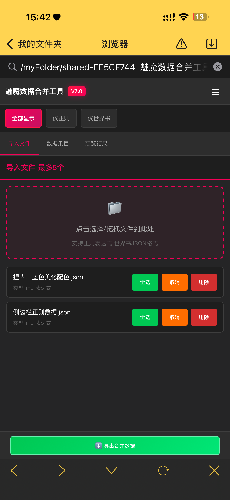
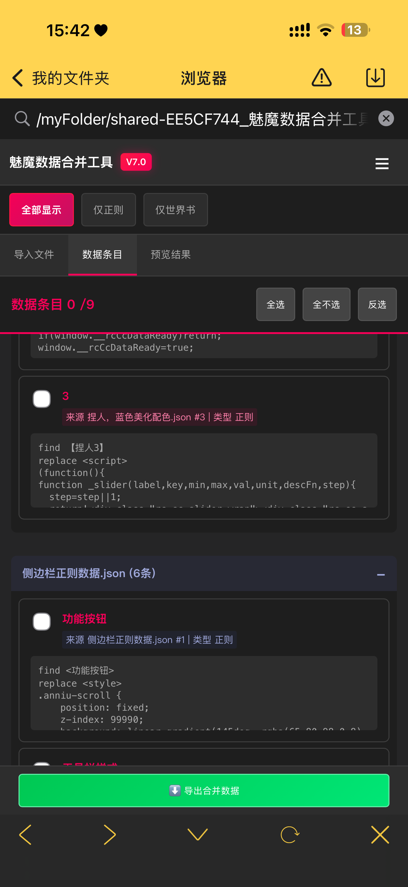
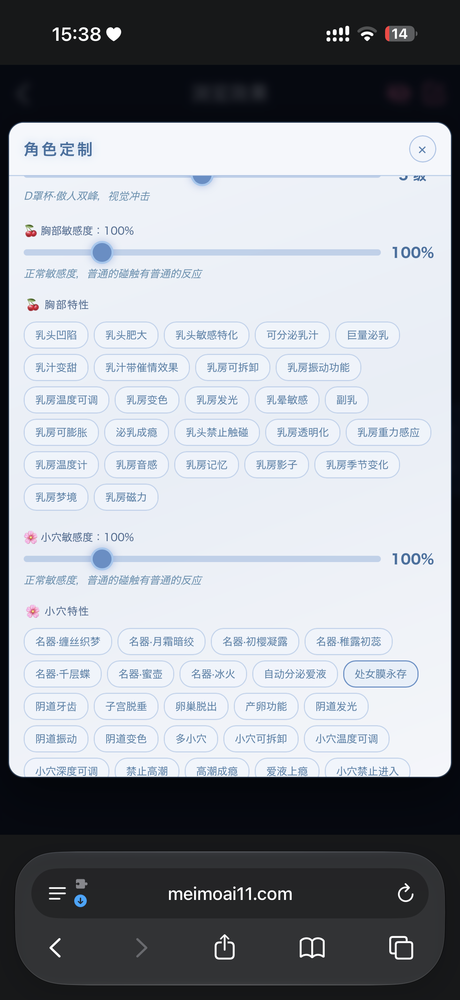
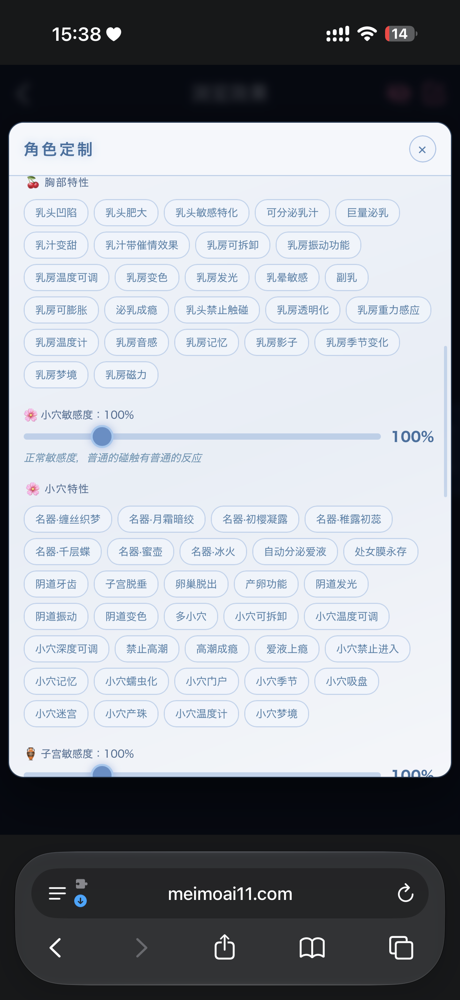
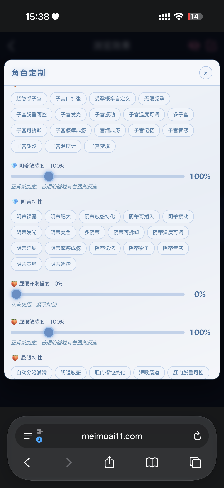

# 一个侧边栏的开源

创建时间: 2026-07-13T07:15:08.002000+00:00
消息数: 13

---

**黑白琴键jojo新卡已上（全网站最强的素卡书写家）** (2026-07-13 08:15:47):
<:1000168531:1298906724979310634>

**黑白琴键jojo新卡已上（全网站最强的素卡书写家）** (2026-07-13 08:15:41):
不用，直接删掉呗

**黑白琴键jojo新卡已上（全网站最强的素卡书写家）** (2026-07-13 08:15:35):
有人想要我就开了

**乱马（你的友好邻居）** (2026-07-13 07:43:03):
可以直接把正则的条目合在一起

**乱马（你的友好邻居）** (2026-07-13 07:41:42):

**乱马（你的友好邻居）** (2026-07-13 07:41:02):
算了，我选择尊重。分享一个数据合并工具

**乱马（你的友好邻居）** (2026-07-13 07:39:21):
这些选项何意味，正常用得到吗

**阳玉** (2026-07-13 07:15:48):
<:emoji_245:1460695536322478268>

**黑白琴键jojo新卡已上（全网站最强的素卡书写家）** (2026-07-13 07:15:37):
啥阴

**黑白琴键jojo新卡已上（全网站最强的素卡书写家）** (2026-07-13 07:15:34):
666

**黑白琴键jojo新卡已上（全网站最强的素卡书写家）** (2026-07-13 07:15:25):

**阳玉** (2026-07-13 07:15:23):
# 顷刻炼化！

**黑白琴键jojo新卡已上（全网站最强的素卡书写家）** (2026-07-13 07:15:08):
捏人开源

