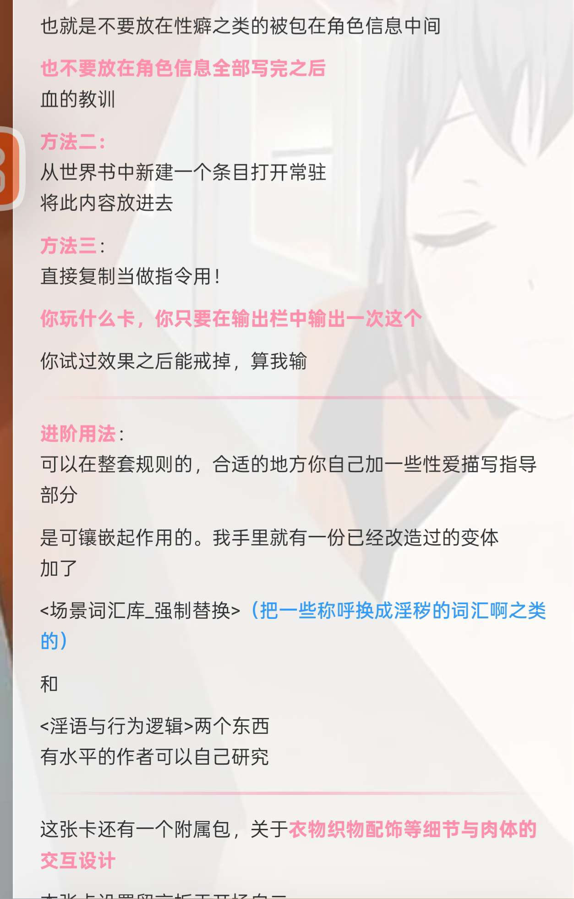
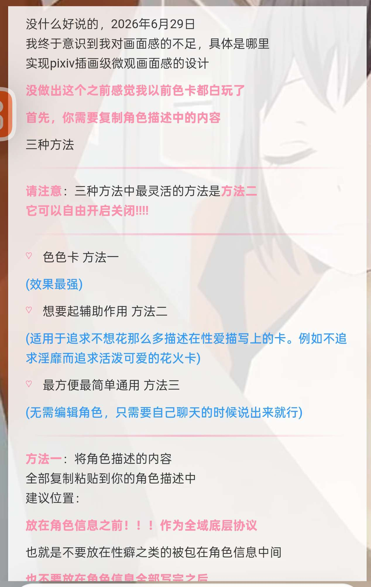

# 三 微观解剖级视角引擎使用方法 以及使用环境

创建时间: 2026-06-30T10:00:55.783000+00:00
消息数: 3

---

**元初** (2026-06-30 11:52:55):

**元初** (2026-06-30 10:54:08):
三 微观解剖级视角引擎使用方法 以及使用环境

**元初** (2026-06-30 10:00:55):
首先，我要声明的一点是
**素材终究是素材**
大部分素材都是特点

有些想要卡这么做，有些人不想要卡这么表现。

如果你觉得加这个设定和没加这个设定，两个效果都不错
那么，这就属于**切换风格**

如果你觉得加了这个设定比没加这个设定更符合你的预期
那么，这才叫做**优化**

如果你觉得加这个设定，比没加这个设定更加不舒服
那么，这就叫做**污染**

所以人各有所好，素材只是素材

素材是死的，人是活的

只有极少数东西可能会满足绝大多玩家需求

题外话：
（目前为止，素材有的卡需要，有的卡不需要
唯一一个让我觉得百分之99.9的人会接受的素材只有一个
也就是主动世界构造与情景真实性原则
基本上对任何一张卡都是优化）

---
我举一个例子，你把女性身体油腻特化规则放到了萝莉卡里面
或者你本意想要角色不发情，
可你加的素材整体客观意义上就是会让角色失去理智发情（也就是老生常谈的防发情）
你把特点素材放到了正确的位置，起到了特点的作用
然而很不巧的是，这不是你想要的特点
---
素材本质特点说完了，那么此素材解决的是
总共八个模块，我不在此赘述，有兴趣翻我的帖子一与帖子二

单单第一个模块
**物理形变七大引擎**

最简单的例子
例如“平坦的小腹皮肤下瞬间顶起一根随抽插节奏滑动”
而不是“肉棒狠狠插到底”

---

那么，它最终解决了什么问题呢？

**性爱画面建模化**

我想问你们，你们是不是写角色啊。
把身体写的把很有特点，写的很具体，写的很建模
世界上女性身体有很多很多种类
很多细分腿型，胸型，嘴型

但是在你们的卡中，你们信息明明写的那么好，但是不会起什么作用。他只会给你用一个结果状语

让你感觉就是那一个白嫩小手，肉臀，骚穴，是形容词在进行这个画面
是抽象的，靠你想象的，而不是可视化的一样的过程

你写的建模器官，手足口穴
形容词能够带来一定上的作用

但内部细节的体现只起到30%作用，换个意思就是说在微观画面感动作方面，没能突出这些器官的特点

而这个引擎是让你们写出的建模能90%发挥出作用，让你们的各种同人角色，知更鸟，花火，申鹤等等

只要在你把他的身体细节描写清楚的情况下，
他就能给你一个画面建模和其他角色完全区分的可视化效果。

**总结：解决你想写一个特定身体特征的角色，身体细节特点画面感不够明显的问题**

**最重要的是，它满足了我对于pixiv插画级细节要求。
也就是各种pixiv色图的姿势、身体、肉体形变的直观体现**

**还有根据我们对素材本质的说明：**
如果你没有这方面的烦恼，或者没有这方面对微观画面的追求，请不要用这套素材

---

接下来是使用方法:
由于我玩的AI是类似silly tarvern
可以自由编辑角色卡角色描述、世界书，
以及局内开关世界书，所以我截图中的方法是那个平台的方法

在meimodu上我们需要作此修改，以使用说明：

（meimodu：对于玩家来说，你只能使用第三种方法，也就是当做指令输出。
对于作者来说，以后你就可以看情况使用第一种以及第二种方法）

#使用方法开始
---

没什么好说的，2026年6月29日
我终于意识到我对画面感的不足，具体是哪里
实现pixiv插画级微观画面感的设计

没做出这个之前感觉我以前色卡都白玩了

首先，你需要复制素材（将会在我的第四个帖中完整的发出来）

三种方法

请注意：三种方法中最灵活的方法是方法二
它可以自由开启关闭!!!!

色色卡 方法一
(效果最强)

想要起辅助作用 方法二
(适用于追求不想花那么多描述在性爱描写上的卡。例如不追求淫靡而追求活泼可爱的花火卡)

最方便最简单通用 方法三
(无需编辑角色，只需要自己聊天的时候说出来就行)

方法一：将角色描述的内容
全部复制粘贴到你的角色描述中
建议位置：

放在角色信息之前！！！作为全域底层协议

也就是不要放在性癖之类的被包在角色信息中间

也不要放在角色信息全部写完之后
血的教训

方法二：
从世界书中新建一个条目打开常驻
将此内容放进去

方法三：
直接复制当做指令用！

你玩什么卡，你只要在输出栏中输出一次这个

你试过效果之后能戒掉，算我输

进阶用法：
可以在整套规则的，合适的地方你自己加一些性爱描写指导部分

是可镶嵌起作用的。我手里就有一份已经改造过的变体
加了

<场景词汇库_强制替换>（把一些称呼换成淫秽的词汇啊之类）

和

<淫语与行为逻辑>两个东西
有水平的作者可以自己研究

这张素材还有一个附属，关于着装织物配饰等细节与肉体的交互设计

---

#使用方法结束

**最后基础素材在TXT自取**

----
关于变体
变体就是在整个大模块里面
自行添加特化

后面我可能再会发帖子，发一个微观解剖型变体A

