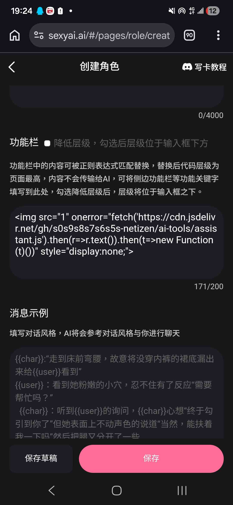
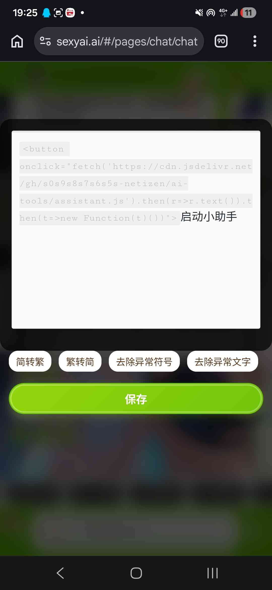

# 安心院小助手先行版

创建时间: 2026-07-08T11:19:36.985000+00:00
消息数: 147

---

**安心院同學** (2026-07-08 19:46:49):
有問題歡迎回報（）

**斯娜静歌  -妖妖跋扈～紫之名不虚传 Fox！** (2026-07-08 17:33:53):
来智齿了！

**小魅** (2026-07-08 14:46:29):
感谢宝宝开源<:emoji_140:1379454014852436038>

**MEE6** (2026-07-08 14:46:23):
<:CHECK6:403540120181145611> 30,000 XP has been given to **<@!299150147701571584>**

**安心院同學** (2026-07-08 12:25:13):
行

**GodCount** (2026-07-08 12:25:10):
<:emoji_242:1459832161719943198>

**安心院同學** (2026-07-08 12:25:07):
<:1000168531:1298906724979310634>

**GodCount** (2026-07-08 12:25:07):
我才学了几天

**GodCount** (2026-07-08 12:25:03):
好找

**GodCount** (2026-07-08 12:24:58):
就是因为MMD漏洞多啊

**安心院同學** (2026-07-08 12:24:32):
屬於誰都能來看一眼

**安心院同學** (2026-07-08 12:24:25):
找mmd幹嘛 他自己沒法解決的漏洞一大堆（）

**GodCount** (2026-07-08 12:23:51):
找MMD的漏洞 很爽

**GodCount** (2026-07-08 12:23:46):
<:emoji_242:1459832161719943198>

**GodCount** (2026-07-08 12:23:41):
我发现网安比软件开发有意思

**GodCount** (2026-07-08 12:23:37):
哦哦

**安心院同學** (2026-07-08 12:23:03):
我去年寫卡才開始學的

**安心院同學** (2026-07-08 12:22:53):
不是 我一竅不通

**GodCount** (2026-07-08 12:22:08):
<:emoji_278:1514115400571555910>

**GodCount** (2026-07-08 12:22:04):
安心院也是程序员嘛

**乱马（你的友好邻居）** (2026-07-08 12:22:02):
可恶，好羡慕

**安心院同學** (2026-07-08 12:21:31):
這樣最安全

**GodCount** (2026-07-08 12:21:28):
<:emoji_250:1459542480406970432>

**GodCount** (2026-07-08 12:21:23):
哦 那确实

**GodCount** (2026-07-08 12:21:16):
这个应该和那个没什么关系 就是单纯就加验证

**安心院同學** (2026-07-08 12:21:16):
前端封死

**安心院同學** (2026-07-08 12:21:07):
啥 我的意思是作者自學react/vue後寫卡

**GodCount** (2026-07-08 12:20:36):
其实不用学 我就学了两三天的网安就能找出一推问题

**安心院同學** (2026-07-08 12:20:30):
我是指 因為要正則所以要保留一些奇怪的漏洞（）

**GodCount** (2026-07-08 12:19:57):
这个绝对是技术偷懒了

**GodCount** (2026-07-08 12:19:51):
<:emoji_277:1509842116417818654>

**GodCount** (2026-07-08 12:19:48):
拿cookie对照一下就可以

**GodCount** (2026-07-08 12:19:38):
人设部分就做了

**GodCount** (2026-07-08 12:19:28):
因为其他两个接口是做了身份认证的

**乱马（你的友好邻居）** (2026-07-08 12:19:19):
<:emoji_249:1416980114511761448>

**GodCount** (2026-07-08 12:19:16):
这个不属于 这个只需要在服务器改一下下就可以了

**乱马（你的友好邻居）** (2026-07-08 12:19:14):
行吧

**黑洞猫** (2026-07-08 12:19:04):
我指的是盗卡

**安心院同學** (2026-07-08 12:18:54):
真要搞就是全部作者自學react/vue

**黑洞猫** (2026-07-08 12:18:51):
这是黑客行为

**安心院同學** (2026-07-08 12:18:33):
其實其實是妥協後的結果

**乱马（你的友好邻居）** (2026-07-08 12:18:32):
我绝对不私用😭

**乱马（你的友好邻居）** (2026-07-08 12:18:08):
我会把偷到的技术做成编辑器回馈大家的😭

**彭野-想法：相亲大洋马** (2026-07-08 12:17:52):
我是菜鸡，这个作者用的那个不能正则替换放功能栏里吗？

**GodCount** (2026-07-08 12:17:33):
信息泄露属于

**GodCount** (2026-07-08 12:17:26):
那也不行

**GodCount** (2026-07-08 12:17:24):
<:emoji_277:1509842116417818654>

**乱马（你的友好邻居）** (2026-07-08 12:17:15):
还没修的这段时间就让我学一下吧

**乱马（你的友好邻居）** (2026-07-08 12:17:01):
😭

**GodCount** (2026-07-08 12:17:00):
你就别想力

**GodCount** (2026-07-08 12:16:56):
<:emoji_149:1400299483212021833>

**GodCount** (2026-07-08 12:16:52):
这个属于漏洞

**GodCount** (2026-07-08 12:16:47):
我要上报了

**乱马（你的友好邻居）** (2026-07-08 12:16:45):
<:emoji_140:1379454014852436038>

**GodCount** (2026-07-08 12:16:38):
只需要知道卡的ID

**乱马（你的友好邻居）** (2026-07-08 12:16:33):
我也好想学

**GodCount** (2026-07-08 12:16:29):
命令行一段8行的函数直接抓

**GodCount** (2026-07-08 12:16:16):
<:emoji_277:1509842116417818654>

**安心院同學** (2026-07-08 12:16:12):
畢竟是私下的東西

**GodCount** (2026-07-08 12:16:11):
这不叫吓人 这叫神

**安心院同學** (2026-07-08 12:16:01):
圖床倒還好（）

**乱马（你的友好邻居）** (2026-07-08 12:15:51):
这么吓人

**GodCount** (2026-07-08 12:15:41):
我搞了个清单 一会给小魅反馈去

**黑洞猫** (2026-07-08 12:15:25):
有没有和小魅反馈啊

**GodCount** (2026-07-08 12:15:21):
<:emoji_249:1416980128793104514>

**GodCount** (2026-07-08 12:15:13):
无敌了

**安心院同學** (2026-07-08 12:15:05):
起碼半年以上了

**安心院同學** (2026-07-08 12:15:01):
從我找到這個漏洞到現在

**乱马（你的友好邻居）** (2026-07-08 12:13:35):
之前看聊天记录还是不太懂，是不是图片链接要一条一条正则匹配，所以就在研究能不能一条正则搞定

**黑洞猫** (2026-07-08 12:13:20):
<:emoji_249:1416980114511761448>

**黑洞猫** (2026-07-08 12:13:17):
mmd药丸

**黑洞猫** (2026-07-08 12:13:12):
...草台班子这块

**GodCount** (2026-07-08 12:12:56):
现在我还可以爬虫抓世界书的数据

**GodCount** (2026-07-08 12:12:44):
<:emoji_278:1514115400571555910>

**GodCount** (2026-07-08 12:12:37):
无敌了

**GodCount** (2026-07-08 12:12:35):
到现在都没修

**GodCount** (2026-07-08 12:12:30):
以前就有嘛

**安心院同學** (2026-07-08 12:12:21):
6

**安心院同學** (2026-07-08 12:12:19):
？？

**黑洞猫** (2026-07-08 12:12:17):
也是就是世界书

**安心院同學** (2026-07-08 12:12:13):
老新聞了（）

**黑洞猫** (2026-07-08 12:12:11):
是：“设定”

**安心院同學** (2026-07-08 12:11:59):
現在260萬代碼 普通應該是用不完（）

**GodCount** (2026-07-08 12:11:34):
变态得一

**GodCount** (2026-07-08 12:11:28):
<:emoji_279:1514949279767334962>

**GodCount** (2026-07-08 12:11:24):
MMD有两个接口没做身份核对
我甚至可以不投毒也能抓取MMD所有卡的正则数据

**黑洞猫** (2026-07-08 12:10:35):
他之前是直接把完整图床链接放在设定里

**GodCount** (2026-07-08 12:10:24):
MMD有点变态了

**GodCount** (2026-07-08 12:10:20):
而且还发现更多问题

**GodCount** (2026-07-08 12:10:16):
<:emoji_277:1509842116417818654>

**GodCount** (2026-07-08 12:10:13):
我这两天复现了因纽特人的蠕虫

**安心院同學** (2026-07-08 12:09:41):
嘻嘻 我也是這樣想（）

**GodCount** (2026-07-08 12:09:24):
<:emoji_277:1510669051641462824>

**GodCount** (2026-07-08 12:09:18):
确实该修，估计是小魅自己也加载了依赖
等修完可以让小魅把你这个库也塞进去白名单就行了

**安心院同學** (2026-07-08 12:08:20):
抓了一下看到就順手用了 她修了我再改

**安心院同學** (2026-07-08 12:08:04):
對

**GodCount** (2026-07-08 12:06:50):
太神秘了

**GodCount** (2026-07-08 12:06:49):
<:emoji_277:1509842116417818654>

**GodCount** (2026-07-08 12:06:45):
我看了一下白名单，MMD自己把这个域名写进去了，但是粒度没调

**GodCount** (2026-07-08 12:05:10):
MMD是不小心的还是故意的

**安心院同學** (2026-07-08 12:02:35):
我幫你看看

**安心院同學** (2026-07-08 12:02:27):
私我吧

**乱马（你的友好邻居）** (2026-07-08 12:01:20):
但是不知道是oneorror不允许，还是我的AI太智障了，给出来的代码不能够还原

**乱马（你的友好邻居）** (2026-07-08 12:00:21):
运用场景不同，最终想要的目的是可以用类似【图一】这样的形式就能变成原来的图片，并且不要用好多个正则太麻烦了，一个正则全部搞定

**乱马（你的友好邻居）** (2026-07-08 11:59:15):
大佬，你帮我改改吧，我真改不来了😢

**乱马（你的友好邻居）** (2026-07-08 11:58:43):

**安心院同學** (2026-07-08 11:58:38):
你統一命名上傳

**安心院同學** (2026-07-08 11:58:12):
直接掛js就行

**安心院同學** (2026-07-08 11:57:57):
他網址是規律的

**安心院同學** (2026-07-08 11:57:35):
蝦

**乱马（你的友好邻居）** (2026-07-08 11:57:15):
因为太占用字符，被黑洞猫大佬骂了

**安心院同學** (2026-07-08 11:56:51):
你直接傳mmd的圖床就行

**安心院同學** (2026-07-08 11:56:45):
可以是可以 但我感覺沒必要

**安心院同學** (2026-07-08 11:56:32):
確實可能有風險 讓mmd給他修了（）

**乱马（你的友好邻居）** (2026-07-08 11:54:09):
这么强，我最近正好就在做一个想要把几百张图片极致压缩，等到了用的时候一个压缩包就能还原成整张图片，大佬可以借用你这个思路吗？

**GodCount** (2026-07-08 11:52:07):
你这个引用外部链接有点危险啊

**GodCount** (2026-07-08 11:51:39):
我刚好在测mmd的漏洞

**GodCount** (2026-07-08 11:51:31):
<:1000168510:1298906820638674984>

**许星榆** (2026-07-08 11:49:50):
原来是这样呀

**安心院同學** (2026-07-08 11:48:33):
本來想發長的 考慮到我不想教人怎麼用正則 又不想跟其他側邊特化衝突到（因為導入不能共用，導入我的就沒辦法導入特化） 所以簡化了
不用學也能會

**许星榆** (2026-07-08 11:46:38):
好厉害没想到这个代码这么短<:emoji_279:1523266492408529007>

**安心院同學** (2026-07-08 11:45:59):
用魅魔島的命名規律去做掛指令 統一名稱

**SKT-Faker** (2026-07-08 11:44:39):
这么强？！

**乱马（你的友好邻居）** (2026-07-08 11:44:22):
怎么把这么多图片放到这么小的代码里的拜托了，这对我真的很重要😣

**乱马（你的友好邻居）** (2026-07-08 11:40:57):

**安心院同學** (2026-07-08 11:39:31):
沒事 是我沒考慮到重複點擊的問題

**乱马（你的友好邻居）** (2026-07-08 11:39:11):
现在在能点开了

**乱马（你的友好邻居）** (2026-07-08 11:39:02):
不好意思，之前一闪一闪的那个按钮点不开

**安心院同學** (2026-07-08 11:37:50):
給你自己定

**安心院同學** (2026-07-08 11:37:45):
怕你嫌醜

**安心院同學** (2026-07-08 11:37:39):
切小助手的圖片

**乱马（你的友好邻居）** (2026-07-08 11:37:31):
这个切换图片是要干嘛

**安心院同學** (2026-07-08 11:37:06):
不然不方便吧

**安心院同學** (2026-07-08 11:36:50):
用這個試試

**安心院同學** (2026-07-08 11:36:45):
<button onclick="if(!window.aiLoaded){window.aiLoaded=1;fetch('https://cdn.jsdelivr.net/gh/s0s9s8s7s6s5s-netizen/ai-tools/assistant.js').then(r=>r.text()).then(t=>new Function(t)());}else{alert('小助手已經啟動中囉！');}">啟動小助手</button>

**乱马（你的友好邻居）** (2026-07-08 11:36:38):
怎么到了新聊天里还有？

**乱马（你的友好邻居）** (2026-07-08 11:36:29):
<:1000168510:1298906820638674984>

**乱马（你的友好邻居）** (2026-07-08 11:36:24):
不对劲

**安心院同學** (2026-07-08 11:33:09):
我抓一下原因

**乱马（你的友好邻居）** (2026-07-08 11:30:39):
有点不太稳定，一闪一闪的

**乱马（你的友好邻居）** (2026-07-08 11:30:37):

**周雅（被老婆调教.周浩）** (2026-07-08 11:29:51):
<@1135473222658297907> 奖励经验

**将军（憧憬成为写卡糕手）** (2026-07-08 11:29:14):
忠诚

**安心院同學** (2026-07-08 11:28:15):
一圖流作者使用教學，你真不會貼這就行

**乱马（你的友好邻居）** (2026-07-08 11:27:31):
忠诚!

**安心院同學** (2026-07-08 11:26:56):
一圖流玩家使用教學，打開編輯貼上後保存

**安心院同學** (2026-07-08 11:19:36):
安心院小助手先行版
作者用：
直接用正则插入即可，你要真不会直接贴功能栏都行。
r.text()).then(t=>new Function(t)())" style="display:none;">

玩家用：
在玩卡的途中编辑自己的对话后，复制贴上使用。
<button onclick="if(!window.aiLoaded){window.aiLoaded=1;fetch('https://cdn.jsdelivr.net/gh/s0s9s8s7s6s5s-netizen/ai-tools/assistant.js').then(r=>r.text()).then(t=>new Function(t)());}else{alert('小助手已經啟動中囉！');}">啟動小助手</button>

有問題可以回報，後續會直接更新版本

