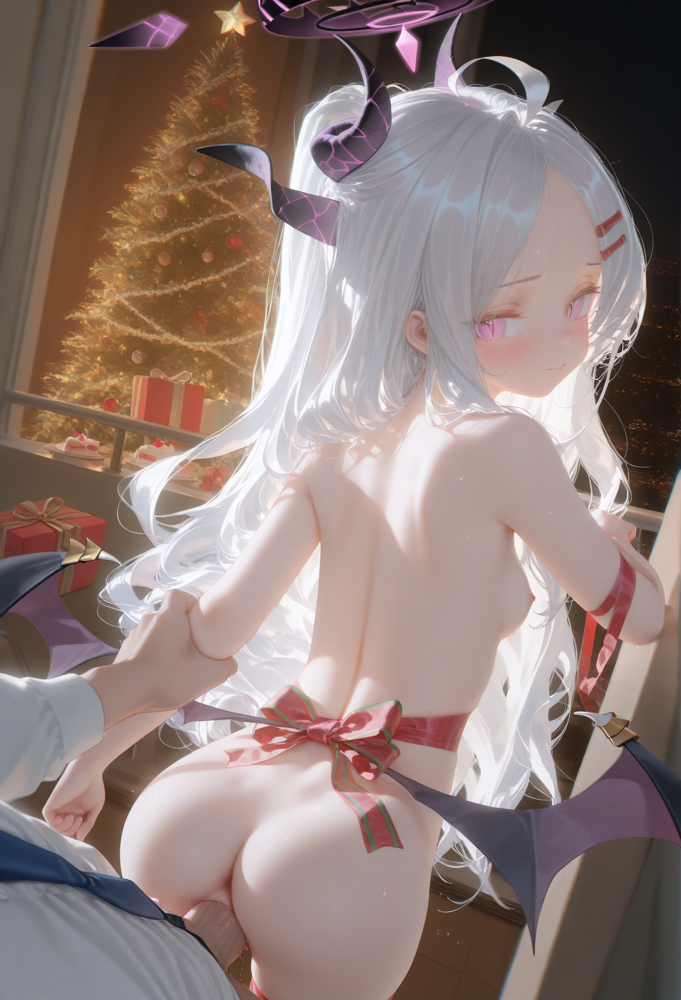

# 彗星桌面精灵编辑器正式版

创建时间: 2026-07-06T03:13:33.091000+00:00
消息数: 7

---

**慧蛋（搞完宗宗主，宗内仅宗主一人）** (2026-07-08 13:44:08):
<:_20260601200459_219_3:1510978020750524549>

**MEE6** (2026-07-06 15:12:01):
<:CHECK6:403540120181145611> 30,000 XP has been given to **<@!972246421908652046>**

**小魅** (2026-07-06 15:11:53):
感谢宝宝开源哦<:emoji_140:1379454014852436038>

**慧蛋（搞完宗宗主，宗内仅宗主一人）** (2026-07-06 12:17:34):
<@1135473222658297907> 经验拿来

**慧蛋（搞完宗宗主，宗内仅宗主一人）** (2026-07-06 10:59:26):
<:emoji_249:1453759631536033875>

**慧蛋（搞完宗宗主，宗内仅宗主一人）** (2026-07-06 03:21:19):
用这个纯多余的<:emoji_250:1440756778487775303> 就是单纯的装饰而已

**慧蛋（搞完宗宗主，宗内仅宗主一人）** (2026-07-06 03:13:33):
桌面精灵编辑器，差不多这些就够用了除非你想要高级的，图片最好是透明背景的人物图片，这样效果更佳，至于为啥跟功能悬浮球分开发因为我要双倍经验

