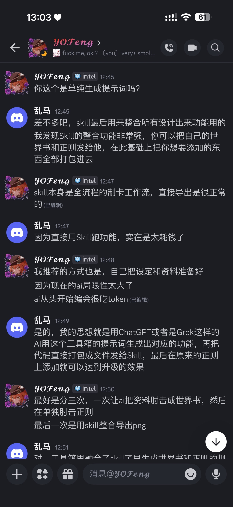
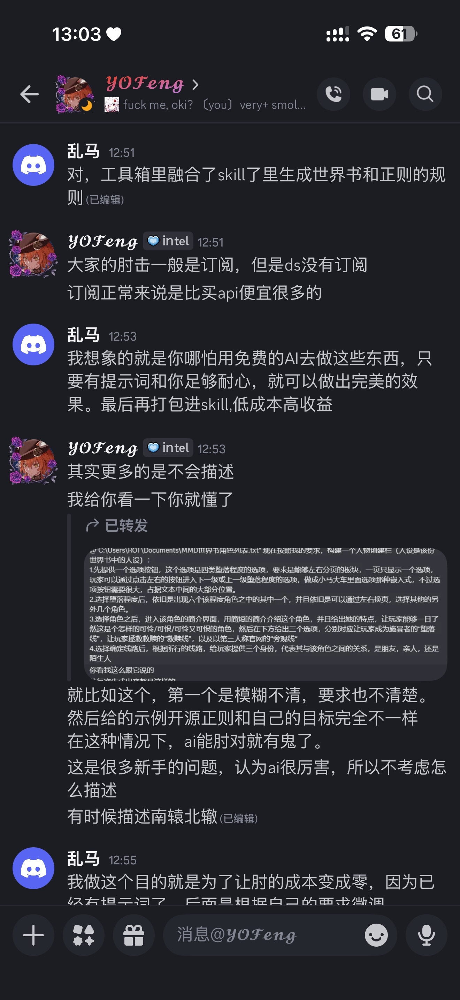
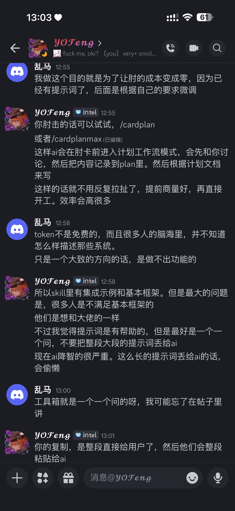
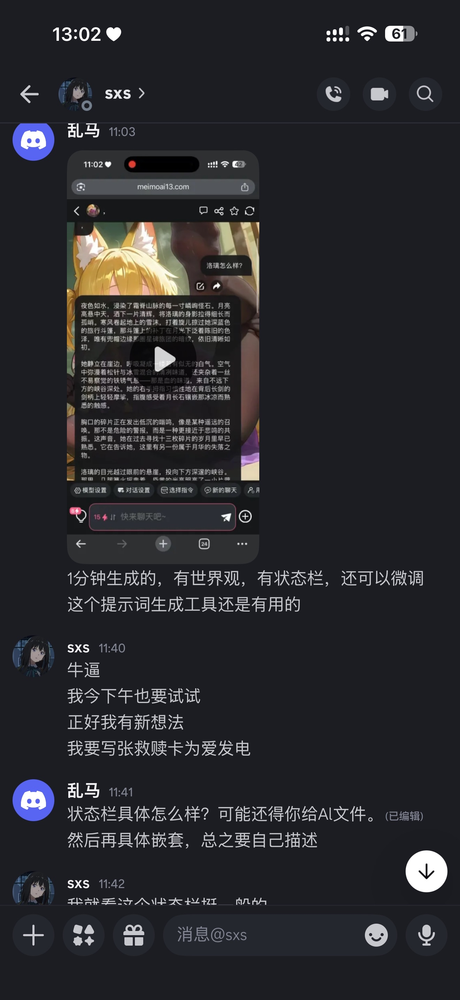
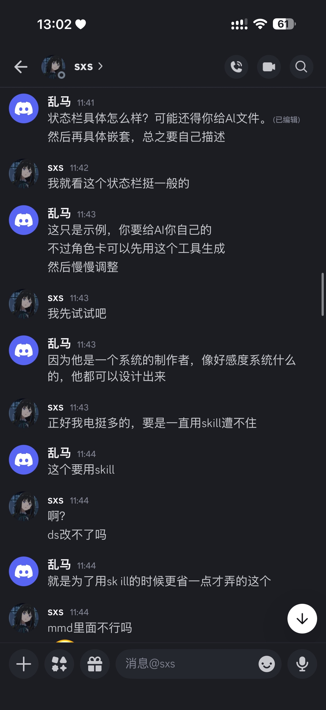
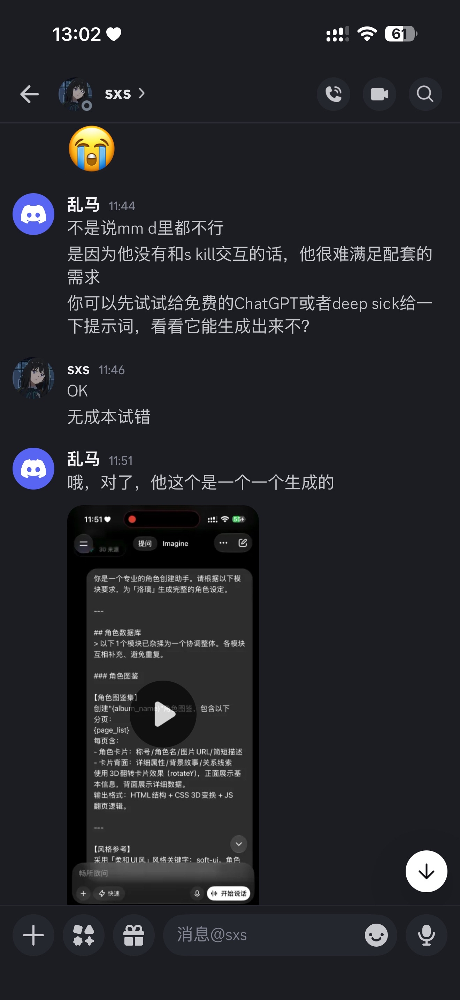
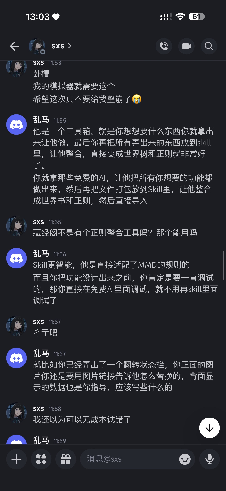
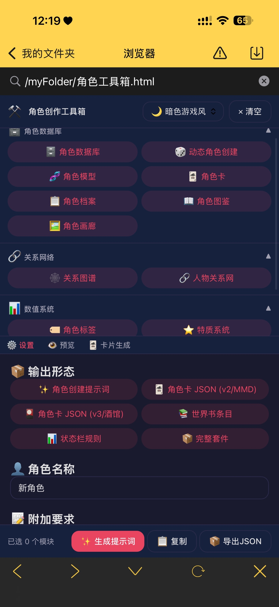

# 角色工具箱半成品

创建时间: 2026-06-26T04:17:55.473000+00:00
消息数: 8

---

**乱马（你的友好邻居）** (2026-06-26 06:49:00):
角色工具箱半成品

**乱马（你的友好邻居）** (2026-06-26 05:04:59):

**乱马（你的友好邻居）** (2026-06-26 05:04:50):
下面是我和洛佬的讨论

**乱马（你的友好邻居）** (2026-06-26 05:03:38):

**乱马（你的友好邻居）** (2026-06-26 05:02:10):
哦，对了，他这个是一个一个生成的

**乱马（你的友好邻居）** (2026-06-26 04:20:06):

**乱马（你的友好邻居）** (2026-06-26 04:18:48):
因为缺少引导，所以是半成品。如果有大佬后面能够做出引导的话，可以另外起一个帖子。

**乱马（你的友好邻居）** (2026-06-26 04:17:55):
杂揉了各种功能的提示词，也可以创建基础人设。具体的使用方法大概就是先用提示词，在免费的AI里面把功能做出来，再把做出来的代码全部扔到Skill里，让他整合成世界书和正则最后直接导入到mmd就可以了。

